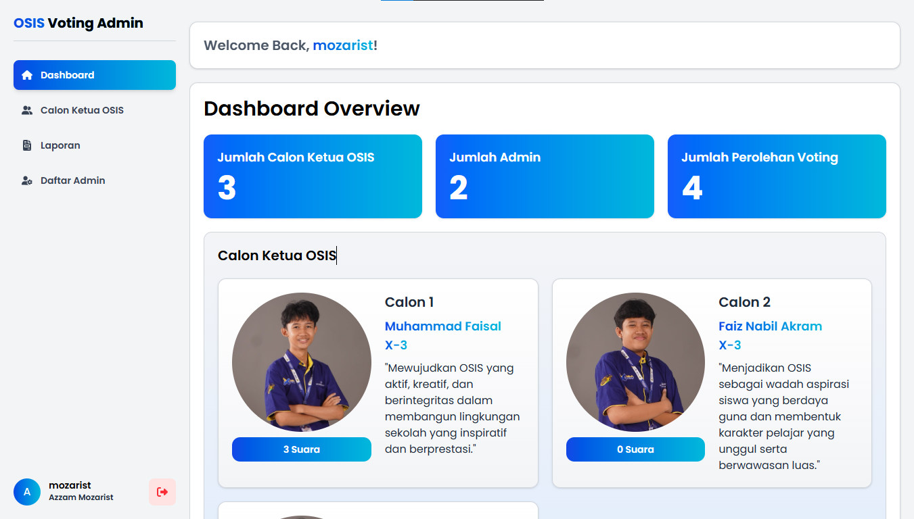

# OSIS-Admin-Voting-Dashboard
# School Election Voting System

A voting web app for school election using PHP & MySQL

## Features
- Voting system

  (admin)
- Admin dashboard login
- Dashboard Overview
- Add & delete candidate
- Add & delete administrator account
- 
- Real-time vote count

## Tech Stack
PHP, MySQL, Tailwind CSS

## Preview

## Demo
You will need a localhost (Laragon,XAMPP,Etc..) and database 
Mozarist

## License

This project is licensed as follows:

- ✅ **Free for personal and non-commercial use**, with credit to **Ahmad Azzam Mozarist**.
- 💼 **Commercial use requires a paid license.**
- ❗ **Modifying or redistributing this project for commercial purposes without permission is prohibited.**

To request a commercial license or collaborate, please contact: azzammozarist.xpro@gmail.com
